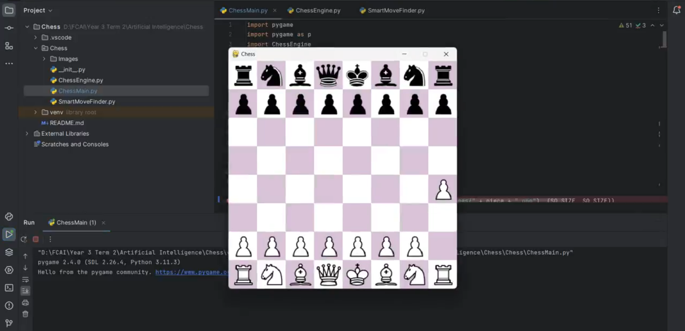

<!DOCTYPE html>
<html lang="en">
<head>
    <meta charset="UTF-8">
    <meta name="viewport" content="width=device-width, initial-scale=1.0">
    
</head>
<body>

<h1>♟️ Chess Game with AI</h1>

    Welcome to the <strong>Chess Game with AI</strong> repository! This Python project features a GUI-based chess game where two AI agents play against each other. 
    It implements advanced algorithms like Minimax and Alpha-Beta Pruning to determine the best moves, making it an exciting exploration of artificial intelligence in games.

<h2>✨ Features</h2>
<ul>
    <li><strong>AI vs. AI Gameplay:</strong> Watch two AI agents compete against each other and analyze the results.</li>
    <li><strong>Graphical User Interface (GUI):</strong> An intuitive interface to visualize the chessboard and moves.</li>
    <li><strong>Minimax Algorithm:</strong> Ensures optimal decision-making by evaluating possible moves.</li>
    <li><strong>Alpha-Beta Pruning:</strong> Enhances the efficiency of the Minimax algorithm by reducing unnecessary computations.</li>
    <li><strong>Result Display:</strong> Displays the game's outcome after each match.</li>
</ul>

<h2>🎥 Demo</h2>

Click the image below to watch the AI-powered Chess game in action!

<h2>🚧 Current Enhancements</h2>
<ul>
    <li>Fixing issues in the game logic.</li>
    <li>Improving the implementation of the chess pieces' moves.</li>
    <li>Refining the AI decision-making process for more realistic gameplay.</li>
</ul>

<h2>🛠️ Technologies Used</h2>
<ul>
    <li><strong>Python</strong></li>
    <li><strong>GUI Library:</strong> (Specify the library used, e.g., Tkinter, Pygame)</li>
    <li><strong>Algorithms:</strong> Minimax and Alpha-Beta Pruning</li>
</ul>

<h2>📚 How to Run</h2>
<ol>
    <li>Clone or download the repository:
        <pre><code>git clone https://github.com/kariiman-ayman/Chess.git</code></pre>
    </li>
    <li>Navigate to the project directory:
        <pre><code>cd Chess</code></pre>
    </li>
    <li>Run the game:
        <pre><code>python chess_gui.py</code></pre>
    </li>
    <li>Watch the two AI agents play against each other in the GUI!</li>
</ol>

<h2>🙌 Contributing</h2>

    Contributions are always welcome! 🎉
    <ul>
        <li><strong>Bug Fixes:</strong> Help resolve issues in the game logic.</li>
        <li><strong>Enhancements:</strong> Improve AI algorithms or the GUI experience.</li>
        <li><strong>Features:</strong> Suggest or add new features like player-vs-AI mode or additional chess rules.</li>
    </ul>

To contribute:

<ol>
    <li>Fork the repository.</li>
    <li>Create a new branch for your changes.</li>
    <li>Submit a pull request describing your updates.</li>
</ol>

⭐ <strong>If you find this project interesting, give it a star on GitHub!</strong>

</body>
</html>
